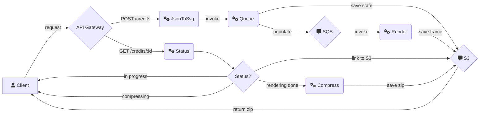

# End Credits Generator

## How to use CLI

1. Install

```sh
git clone https://github.com/ra100/end-credits-gen.git
npm install
```

2. Run

Open `cli` folder: `cd cli`

```bash
npm --workspace=cli start ./input.yaml ./export.svg
```

To export **png** file directly, you need to have [inkscape](https://inkscape.org)
installed, and run:

```bash
npm --workspace=cli start ./input.yaml ./export.png
```

To export rendered frames with crawl speed configured by `ppf` setting in yaml

```bash
npm --workspace=cli start ./input.yaml ./export/folder/
```

This will produce folder with files `./export/folder/credits_<frame number>.png`

## Deploy to AWS

1. Install

```sh
git clone https://github.com/ra100/end-credits-gen.git
npm install
```

2. Get AWS credentials and save in `~/.aws/credentials` (or any other way to allow CDK to deploy)

```ini
[default]
aws_access_key_id = YOUR_ID
aws_secret_access_key = YOUR_SECRET_KEY
```

3. Run CDK

```bash
npm --workspace=cdk run cdk bootstrap
npm --workspace=cdk run cdk deploy
```

This will output link to API Gateway, save it. So you can call it later.

## How to use deployed API:

1. POST credits in JSON format to: `<your_url>/credits`
   you'll get response in format:

```json
{
  "message": "Render queued",
  "id": "C4E50HTlpLKOl0fnfjoA7"
}
```

2. Get status of the render, call GET to `<your_url>/credits/{id}`
   You'll get status or redirect to download zip with rendered credits.

## Custom Fonts

To be able to use custom fonts, you need to add them to `png/fonts` directory.

## Example

Get this:


From this: [example.yaml](./example.yaml)

## Cloud development

### Useful commands

- `cdk deploy` deploy this stack to your default AWS account/region
- `cdk diff` compare deployed stack with current state
- `cdk synth` emits the synthesized CloudFormation template

## Overview Diagram



## License

[GNU LGPLv3](./LICENSE)
